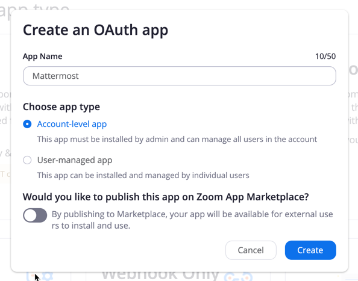
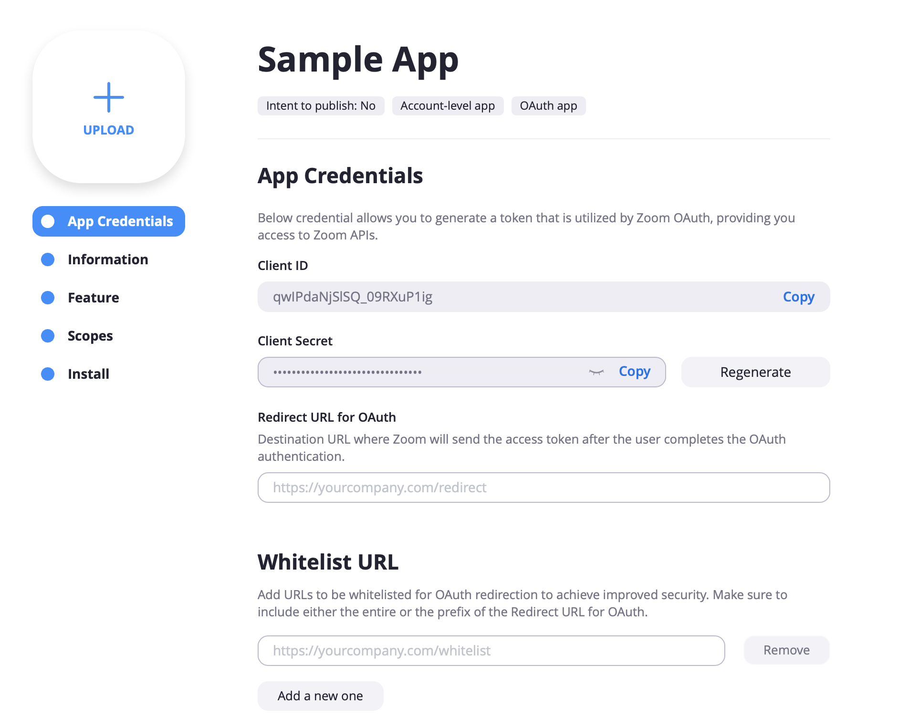
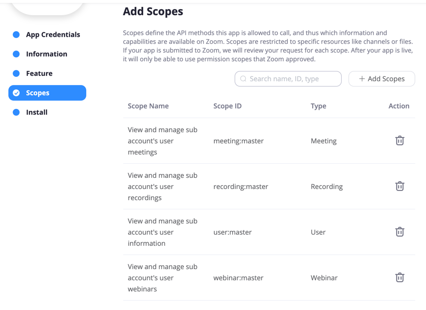

# Zoom Setup \(Oauth\)

We are going to set the **OAuth ClientID** and **OAuth Secret**, generated by Zoom and used to create meetings and pull user data:

* Go to [https://marketplace.zoom.us/](https://marketplace.zoom.us/) and log in as an admin.

## Create an App for Mattermost to connect with:

* In the top left click on **Develop** and then **Build App**.
* Select **OAuth** in **Choose your app type** section.
* Enter a name for your app and disable **Intend to publish this app on Zoom Marketplace**.
* Choose **Account-level app** as the app type.
* Click **Create**.

  

## Configure your new Oauth App to work with Mattermost

* Enter the **Company Name** and **Developer Contact Information** for your app.
* Go to the **App Credentials** tab on the left. Here you'll find your **Client ID** and **Client Secret**.
  * These need to be copied and pasted into the Zoom Plugin configuration screen: **Plugin Marketplace &gt; Zoom &gt; Configure** under the Oauth section.
* Enter a Valid **Redirect URL for OAuth** \(`https://<SiteUrl>/plugins/zoom/oauth2/complete`\) and add the same url under **Whitelist URL**.
  * `SiteUrl` should be your mattermost server url

## Add User Scopes to the App

* Click on "Scopes"
* Add following scopes "user:read", "meeting:write", "webinar:write", "recording:write"
* Paste the **Client ID** and **Client Secret** into the fields in the System Console, and hit **Save**.
* Generate an **Encryption Key** to save the encryped tokens.

## Configure Webhook Events

When a meeting finishes in Zoom, the original link shared in the channel can be changed to indicate the meeting has ended and how long it lasted.  To enable this functionality, we need to create a webhook subscription in Zoom that tells the mattermost server every time a meeting ends, then Mattermost can update the original Zoom message. 

* Click "Add New Event Subscription" and call it "Meeting Ended"
* Select "All Users in the account"
* The notification endpoint URL should be copied from the Zoom configuration page at the very bottom in this format \(substitute the webhook secret you generated on this screen\): [https://SITEURL/plugins/zoom/webhook?secret=WEBHOOKSECRET](https://SITEURL/plugins/zoom/webhook?secret=WEBHOOKSECRET)

* Click "Add Events" and select the "End Meeting" event:

* Click "Done" and then save your App.

## Finish Setting up Mattermost Server

1. Enable settings for [overriding usernames](https://docs.mattermost.com/administration/config-settings.html#enable-integrations-to-override-usernames) and [overriding profile picture icons](https://docs.mattermost.com/administration/config-settings.html#enable-integrations-to-override-profile-picture-icons).
2. Activate the plugin at **Plugin Marketplace &gt; Zoom &gt; Configure** then switching "Enable Zoom plugin" to  **True** and click "Save"

